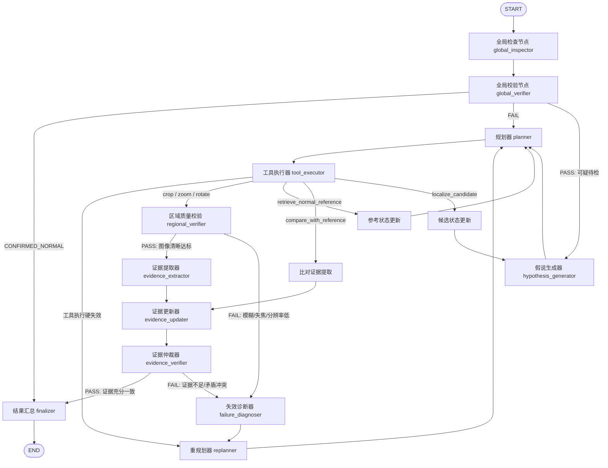

# HJL: Hierarchical Judgment Loop (分层判断回路)

> **工业视觉异常检测的分层认知与主动排查智能体架构**  
> 面向高分辨率微小瑕疵、复杂形变与柔性工况的自主质检决策系统。

---

## 目录
- [1. 架构总览与核心设计](#1-架构总览与核心设计)
- [2. 状态机拓扑与控制流](#2-状态机拓扑与控制流)
- [3. 三阶段认知推进](#3-三阶段认知推进)
- [4. 三级解耦守门检查点](#4-三级解耦守门检查点)
- [5. 失效分类学与策略自愈闭环](#5-失效分类学与策略自愈闭环)
- [6. 证据状态机与抗幻觉不变量](#6-证据状态机与抗幻觉不变量)
- [7. 运行引擎与四种对比模式](#7-运行引擎与四种对比模式)
- [8. Canonical 轨迹协议与数据解耦](#8-canonical-轨迹协议与数据解耦)
- [9. 目录与代码模块索引](#9-目录与代码模块索引)
- [10. 快速上手使用指南](#10-快速上手使用指南)

---

## 1. 架构总览与核心设计

传统工业异常检测（IAD）与现有多模态大模型质检主要存在两大局限：
1. **静态单次推理（Single-turn Forward）**：无法像人类专家一样“先宏观扫视、发现可疑点再主动局部放大，遇到模棱两可时调取金样对比”。
2. **缺乏状态容错与证据约束**：大模型自由生成容易在噪声干扰下产生幻觉；普通 ReAct 智能体在工具调用失效时易陷入无限无效调用。

**HJL（Hierarchical Judgment Loop）** 将资深质检专家的主动排查逻辑形式化为严格的状态图（StateGraph），实现了从**全局粗筛**、**多尺度微观探查**到**基准标准比对**的认知闭环：

```
               [ 输入工件图像 ]
                      │
                      ▼
            ┌───────────────────┐
            │ 全局检查 (Global)  │ ──(高置信正常)──► [ Fast-Path 0步直通 ] ──► CONFIRMED_NORMAL
            └───────────────────┘
                      │ (存在可疑或未确定)
                      ▼
            ┌───────────────────┐
            │ 假说生成与区域定位 │
            └───────────────────┘
                      │
                      ▼
            ┌───────────────────┐
            │ 主动微观工具探查  │ ◄──────────┐
            │ (Crop/Zoom/Rotate)│             │
            └───────────────────┘             │ (失效策略自愈重规划)
                      │                       │
                      ▼                       │
            ┌───────────────────┐             │
            │ 区域质量硬校验    │ ──(校验失败)──┤
            └───────────────────┘             │
                      │ (PASS)                │
                      ▼                       │
            ┌───────────────────┐             │
            │ 证据状态提取与更新│             │
            └───────────────────┘             │
                      │                       │
                      ▼                       │
            ┌───────────────────┐             │
            │ 证据充分性仲裁    │ ──(待解冲突)──┘
            └───────────────────┘
                      │ (PASS: 证据充分且一致)
                      ▼
            [ 最终结构化质检结论 ] (ANOMALY / NORMAL)
```

---

## 2. 状态机拓扑与控制流

系统采用零外部依赖、轻量且具备强类型校验的 `StateGraph`（位于 `hjl/graph.py`），核心节点与路由逻辑如下：



---

## 3. 三阶段认知推进

状态通过 `HJLState.phase`（`HJLPhase` 枚举）在三个认知阶段间单向/有约束推进：

| 阶段 (`HJLPhase`) | 职责定位 | 典型动作 | 准出条件 |
| :--- | :--- | :--- | :--- |
| **`GLOBAL_DISCOVERY`** | 全图宏观初筛与可疑区域定位 | `inspect_global`, `localize_candidate` | 确认全图高置信度正常（Fast-path 退出）或生成初始可疑 ROI 假说 |
| **`HYPOTHESIS_INSPECTION`** | 针对具体可疑 ROI 的多尺度微观探查 | `crop_region`, `zoom_region`, `rotate_image` | 区域质量校验通过并成功提取该区域的原子支撑/反驳证据 |
| **`EVIDENCE_RESOLUTION`** | 证据矛盾裁决与基准比对 | `retrieve_normal_reference`, `compare_with_reference` | 证据量化分值超越判定阈值，或达到最大探索预算触发最佳努力判定 |

---

## 4. 三级解耦守门检查点

系统设立了三层严格解耦的独立校验逻辑，绝不将低质观察带入后续决策：

1. **全局检查点（Global Checkpoint）**：
   - 状态：`CONFIRMED_NORMAL`, `PASS`, `FAIL`
   - 规则：当且仅当 VLM 宏观巡检未见任何异常候选且置信度 $\ge \text{threshold}$（默认 0.95）时触发 `CONFIRMED_NORMAL` 毫秒级退出；若巡检结果格式异常则标记为 `FAIL` 进入探索排查。
2. **区域质量检查点（Regional Checkpoint）**：
   - 状态：`PASS`, `FAIL`
   - 规则：微观裁剪或放大后的局部图，必须满足空间几何合法性与有效分辨率（如 ROI 尺寸不能小于 12px 且不能全黑/失真）。未通过质量校验的图像**绝对禁止污染证据库**，直接分流至失效诊断。
3. **证据充分性检查点（Evidence Checkpoint）**：
   - 状态：`PASS`（输出确切 `ANOMALY` 或 `NORMAL`）、`FAIL`（输出 `UNRESOLVED` 驱动深入排查）
   - 规则：综合量化证据池中的支撑项与反驳项，分值必须越过清晰的安全阈值（默认异常阈值 0.75，正常阈值 0.20）。

---

## 5. 失效分类学与策略自愈闭环

HJL 显式定义了 8 种工业质检失效分类（`FailureType`），并通过 `FailureRoutingPolicy`（位于 `hjl/routing.py`）将其确定性映射到合法的纠错候选动作（`ActionType`）：

```
[ 失效发生 ] ──► [ failure_diagnoser ] ──► [ 确定 FailureType ] ──► [ FailureRoutingPolicy 动作掩码 ] ──► [ replanner 纠错 ]
```

| 失效类型 (`FailureType`) | 典型物理场景 | 策略映射的纠错动作掩码 (`ActionType`) |
| :--- | :--- | :--- |
| **`LOW_RESOLUTION`** | 裁剪区域像素太小（<12px）或细节模糊 | `ENHANCE_REGION`（放大探查区域） |
| **`MISSING_REFERENCE`** | 待检表面纹理复杂，难以凭经验断定是否有瑕疵 | `RETRIEVE_REFERENCE`（调取正品标准模板） |
| **`CONTRADICTORY_EVIDENCE`**| 局部观察与全局判断矛盾，或多个 ROI 证据冲突 | `CROSS_VALIDATE`（与标准模板执行残差比对） |
| **`LOCALIZATION_UNCERTAIN`**| 疑似反光或脏污，ROI 边界漂移 | `RELOCALIZE`（重新全局扫描定位） |
| **`DISCOVERY_EXHAUSTION`**  | 当前 ROI 排除异常，但整图仍有疑点 | `INSPECT_NEXT_REGION`（探索下一候选区） |
| **`INSUFFICIENT_EVIDENCE`** | 证据链不足以跨越判定门槛 | `CROSS_VALIDATE`, `ENHANCE_REGION` |
| **`UNVERIFIABLE_REGION`**   | 严重遮挡或视场外越界 | `INSPECT_NEXT_REGION`, `RELOCALIZE` |
| **`TOOL_FAILURE`**          | 底层网络闪断、沙箱超时或参数非法 | `RETRY_TOOL`（结合状态快照安全回滚重试） |

### 上下文快照与回滚机制 (`ToolExecutionContext`)
每次工具执行前均创建轻量快照：
```python
checkpoint = context.checkpoint()
```
一旦工具执行报错或区域校验未通过，系统调用 `context.rollback(checkpoint)` 将变换中的图像文件指针与坐标系干净地复原到上一健康状态，防止图像多次形变叠加导致严重畸变。

---

## 6. 证据状态机与抗幻觉不变量

### 证据形式化表达 (`EvidenceState`)
所有探查结果被严格转化为不可篡改的原子证据条目：
```python
@dataclass(frozen=True)
class EvidenceItem:
    step: int
    region: tuple[int, int, int, int]    # 严格对齐至原图全局坐标系
    target: str                           # 缺陷特征标签
    description: str                      # 特征描述
    relation: EvidenceRelation            # SUPPORT(+) / CONTRADICT(-) / NEUTRAL(0)
    confidence: float                     # 0.0 ~ 1.0
    source_tool: str                      # 产出证据的具体工具
```

### 数学级抗幻觉不变量（Hard Invariants）
- **无正向证据绝不判正常（Zero-evidence Normal Prevention）**：在宏观检查发现了可疑区域的前提下，如果微观探查未搜集到明确的正面反驳证据，即使探索步数耗尽，系统结论也只能停留在 `UNRESOLVED`，严禁脑补为 `NORMAL`。
- **模板防数据泄漏检查（Anti-leakage Check）**：`retrieve_normal_reference` 检索到的基准图在底层由 `validate_reference_metadata` 强校验，严格断言 `split == "train"` 且 `is_normal == True`，杜绝测试集金样泄漏。

---

## 7. 运行引擎与四种对比模式

`HJLEngine`（`hjl/engine.py`）统一封装了用于学术对比实验的四种运行模式：

```
                ┌───► 模式 1: direct (单次直接前向基线)
                │
                ├───► 模式 2: react (通用 ReAct 工具闭环基线)
HJLEngine ──────┤
                ├───► 模式 3: react_verifier (ReAct + 事后 VLM 轨迹复核基线)
                │
                └───► 模式 4: hjl (完整 HJL 分层判断回路)
```

1. **`direct` 模式**：标准 VLM Single-turn 前向判定，作为大模型零样本/单图能力基线。
2. **`react` 模式**：通用智能体工具循环，模型直接面对工具库自主做决策与终止。
3. **`react_verifier` 模式**：ReAct 产生最终结论后，由独立 VLM 质检复核员对历史轨迹进行一致性审查。
4. **`hjl` 模式**：完整的 HJL 状态机图执行流程，包含三级检查点与失效策略自愈。

---

## 8. Canonical 轨迹协议与数据解耦

为无缝接入强化学习（VERL GRPO/PPO）与微调（SFT），HJL 实现了清晰的**“双轨制”**轨迹导出协议（遵循 `agent0.responses.v1` 规范）：

```
[ 状态机实际运行 ]
        │
        ├─────────────────────────────────────────────────┐
        ▼                                                 ▼
[ Runtime Audit Log (执行审计日志) ]           [ Canonical Trajectory (训练认知轨迹) ]
• 包含全部底层执行细节                           • 仅使用 agent_visible=True 语义参数
• 记录实际 corpus_dir、真实本地参考图路径          • 剥离 corpus_dir、allow_synthetic 等注入参数
• 保留 sandbox 进程与沙箱耗时                     • retrieve_normal_reference 参数规约为 {}
• 写入 hjl_trajectory.jsonl 用于评测与复盘        • 严格通过 Draft202012Validator 模式校验
                                                • 保存为 *_canonical.json 直接喂入 SFT / RL
```

---

## 9. 目录与代码模块索引

```text
hjl/
├── __init__.py               # 包导出与版本声明
├── config.py                 # HJLConfig 全局配置定义与 YAML 解析
├── state.py                  # HJLState、EvidenceState 核心状态与枚举
├── taxonomy.py               # 检查点状态、8种 FailureType、ActionType 分类学
├── routing.py                # FailureRoutingPolicy 动作掩码路由策略
├── tools_adapter.py          # 工具标准化适配器 (ToolResult, 图像差分与参考检索)
├── schemas.py                # 强类型响应数据结构 (CandidateRegion, InspectionResult 等)
├── model_caller.py           # 结构化 Responses API 交互层与 Mock Caller
├── engine.py                 # 统一执行引擎 (支持 direct, react, react_verifier, hjl)
├── trajectory.py             # agent0.responses.v1 Canonical 轨迹导出与校验
├── graph.py                  # StateGraph 状态机编排与节点连接
├── run.py                    # 命令行 CLI 执行入口
│
├── nodes/                    # 状态机具体执行节点
│   ├── global_inspector.py   # 全局视觉扫描
│   ├── global_verifier.py    # 全局快速退出/放行检查点
│   ├── hypothesis_generator.py # 缺陷候选假说生成
│   ├── planner.py            # 工具动作规划 (包含参数组装)
│   ├── tool_executor.py      # 工具适配执行与上下文 checkpoint
│   ├── regional_verifier.py  # 局部 ROI 分辨率与图像质量硬校验
│   ├── evidence_extractor.py # 区域观察特征提取
│   ├── evidence_updater.py   # 证据状态更新与综合打分计算
│   ├── evidence_verifier.py  # 证据充分性仲裁检查点
│   ├── failure_diagnoser.py  # 8 类失效语义识别与诊断
│   ├── replanner.py          # 基于策略动作掩码的纠错重规划
│   ├── state_updaters.py     # 参考图/候选框状态更新
│   └── finalizer.py          # 最终结论组装与统计封包
│
└── policies/                 # 策略逻辑模块
    ├── failure_policy.py     # 失效升级与重试上限策略
    └── stopping_policy.py    # 自适应步数预算终止决策
```

---

## 10. 快速上手使用指南

### 环境与凭据准备
确保在项目根目录创建并配置 `.env` 文件（参考 `.env.example`）：
```bash
AGENT0_RESPONSES_BASE_URL=https://your-api-gateway.com/v1
AGENT0_RESPONSES_API_KEY=your_actual_api_key
AGENT0_RESPONSES_MODEL=qwen2.5-vl-7b-instruct
```

### 1. 运行单张工件实机检测 (Live Mode)
```bash
# 模式 4: 完整 HJL 分层闭环检测
.venv/bin/python -m hjl.run --image data/mvtec/bottle/test/broken_large/000.png --category bottle --mode hjl

# 模式 1: 单次直接推理基线
.venv/bin/python -m hjl.run --image data/mvtec/bottle/test/broken_large/000.png --category bottle --mode direct

# 模式 2: 通用 ReAct 基线
.venv/bin/python -m hjl.run --image data/mvtec/bottle/test/broken_large/000.png --category bottle --mode react --max-steps 4
```

### 2. 离线 Mock 快速冒烟测试 (无需 API Key)
```bash
.venv/bin/python -m hjl.run --mock --mode hjl --max-steps 8
```

### 3. 查看输出产物
运行完成后，检测结论将在控制台打印，完整轨迹保存在 `outputs/hjl_trajectories/`：
- `hjl_trajectory.jsonl`：逐步骤全量执行审计记录。
- `sample_call_*_canonical.json`：符合 `agent0.responses.v1` 协议的模型认知训练轨迹。
