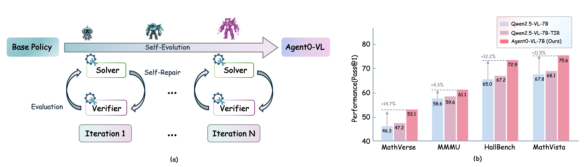

# Agent0-VL: Exploring Self-Evolving Agent for Tool-Integrated Vision-Language Reasoning

<div align="center">

[](https://arxiv.org/abs/2511.19900)
[](../LICENSE)
[](https://www.python.org/downloads/)
[](https://pytorch.org/)

*A Self-Evolving Vision-Language Agent with Tool-Integrated Reasoning, Evaluation, and Self-Repair*

Jiaqi Liu, Kaiwen Xiong, Peng Xia, Yiyang Zhou, Haonian Ji, Lu Feng, Siwei Han, Mingyu Ding, Huaxiu Yao

UNC-Chapel Hill

</div>

---

## 📖 Overview

<p align="center">
  
</p>

**Agent0-VL** is a self-evolving vision-language agent that achieves continual improvement through tool-integrated reasoning, evaluation, and self-repair. Unlike traditional vision-language models that rely on external supervision, Agent0-VL autonomously refines its reasoning capabilities by unifying reasoning, verification, and correction within a single model.

### 🎯 Core Innovation

Agent0-VL introduces a **Self-Evolving Reasoning Cycle (SERC)** that enables the model to:
- **Reason**: Perform multi-turn tool-integrated visual reasoning
- **Verify**: Self-evaluate reasoning steps using tool-grounded evidence
- **Repair**: Selectively correct errors based on verification feedback
- **Evolve**: Continuously improve through reinforcement learning

This closed-loop system allows Agent0-VL to achieve **zero external reward** self-improvement, eliminating the need for human annotations or external reward models.

---

## 🔥 Key Features

### Dual-Role Architecture
Agent0-VL operates through two synergistic roles within a single LVLM:

- **🧠 Solver**: Performs multi-turn reasoning and dynamically invokes external tools (code interpreter, vision APIs) for grounded computation and visual perception.

- **✅ Verifier**: Validates intermediate reasoning steps through generative critique and tool-based feedback, producing structured feedback `V_t = (score_t, conf_t, critique_t)` and triggering **confidence-gated self-repair** when `conf_t < τ_c`.

Both roles share one policy, jointly optimized with **GRPO** on self-generated process rewards.

### Technical Highlights
- ✨ **Zero External Reward**: No human annotation or external reward models required
- 🔧 **Tool-Integrated Evaluation**: Uses external tools not only for reasoning but also for self-evaluation
- 🔄 **Selective Self-Repair**: Confidence-gated mechanism for efficient error correction
- 📈 **Iterative Evolution**: Monotonic performance improvement across training iterations
- 🎯 **Dual Functionality**: Serves as both a reasoning agent and a process reward model

### Reward Formulation (paper Eq. 2–5)

```
r_proc^(t) = λ_tool · r(tool_t) + score_t · conf_t − β_div · D_KL      (process reward)
g_t        = σ(κ(τ_c − conf_t))                                        (repair gate)
r_t        = r_proc^(t) − g_t · C_repair^(t)                           (effective step reward)
g(τ)       = α_out · r_out + Σ_t γ^(t−1) · r_t                         (trajectory return)
```

The rollout worker (`verl/workers/rollout/vllm_rollout/vllm_agent0_rollout_spmd.py`) executes the SERC inner loop and exports per-step verification results; the reward manager (`verl/workers/reward_manager/agent0.py`) turns them into token-level rewards whose sequence-sum is exactly `g(τ)`, which GRPO then normalizes per prompt group.

---

## 🚀 Quick Start

### Installation

Requirements: Linux, CUDA ≥ 12.4 (to match the torch 2.6 / cu124 build below), 8× A100/H100/H200 recommended for full training.

```bash
# Clone the repository
git clone https://github.com/aiming-lab/Agent0.git
cd Agent0/Agent0-VL

# Create environment
conda create -n agent0vl python=3.10 -y
conda activate agent0vl

# PyTorch (must match the vLLM build below — vLLM 0.8.2 requires torch 2.6.x)
pip install torch==2.6.0 --index-url https://download.pytorch.org/whl/cu124
pip install -r requirements.txt

# vLLM for RL rollout and evaluation (GPU machines)
pip install vllm==0.8.2

# flash-attn (needed for training; builds against the torch installed above)
pip install flash-attn --no-build-isolation

# Optional: ms-swift for the vision-language SFT stage (paper pipeline)
pip install ms-swift
```

Verify the sandbox (works on CPU-only machines, no GPU required):

```bash
python -c "import asyncio; from sandbox.internal_sandbox import parallel_sandbox; \
print(asyncio.run(parallel_sandbox(['print(40+2)'])))"   # expect: ([True], ['42\n'], [''])
```

### Sandbox for Tool Execution

Tool calls (Python code) run in a sandbox. Two backends are supported, chosen automatically:

- **Local subprocess sandbox** (default, zero setup): code runs in resource-limited local subprocesses (`sandbox/subprocess_sandbox.py`).
- **HTTP sandbox service**: set `SANDBOX_ENDPOINT=http://...` to use a [SandboxFusion](https://github.com/bytedance/SandboxFusion)-compatible service — recommended for large-scale training.

### Training Pipeline

Agent0-VL follows a three-stage training pipeline. Training reads
verl-compatible parquet files; point `data.train_files` / `data.val_files`
at your prepared data for each stage.

#### 1. SFT Cold Start (two stages, as in the paper)

The paper's SFT uses ms-swift with images (stage 1: tool-usage data, stage 2: annealing on math-code data):

```bash
# Stage 1: tool usage & image manipulation (lr 1e-5)
MODEL=Qwen/Qwen2.5-VL-7B-Instruct SFT_DATA=<stage1_data> bash scripts/sft_stage1.sh

# Stage 2: math-code annealing (lr 1e-6), starting from stage-1 output
MODEL=checkpoints/sft_stage1 SFT_DATA=<stage2_data> bash scripts/sft_stage2.sh
```

Alternative (verl FSDP, text-rendered trajectories only): `bash scripts/train_sft.sh`.

#### 2. Self-Evolving RL Training (SERC)

```bash
# Iteration 1 (from the SFT checkpoint)
MODEL_PATH=checkpoints/sft_stage2 ITERATION=1 bash scripts/rl-agent0.sh

# Iterations 2 and 3: initialize from the previous iteration's checkpoint
MODEL_PATH=checkpoints/Agent0-VL/agent0_vl_serc_iter1/... ITERATION=2 bash scripts/rl-agent0.sh
MODEL_PATH=checkpoints/Agent0-VL/agent0_vl_serc_iter2/... ITERATION=3 bash scripts/rl-agent0.sh
```

Equivalent direct launch:

```bash
python3 -m verl.trainer.main_ppo --config-name=agent0_trainer \
    actor_rollout_ref.model.path=<model> \
    data.train_files=data/agent0/train.parquet data.val_files=data/agent0/val.parquet
```

> **Note:** always launch RL with `--config-name=agent0_trainer`; new keys added on the command line need a `+` prefix (Hydra).

#### 3. Evaluation

```bash
bash scripts/evaluate.sh \
    --model_path ./checkpoints/Agent0-VL/agent0_vl_serc_iter3 \
    --benchmarks mathverse,mathvista,chartqa \
    --output_dir ./evaluation_results
```

For publication-grade benchmark numbers, evaluate the trained checkpoint with [VLMEvalKit](https://github.com/open-compass/VLMEvalKit) as an external harness.

### Training Configuration (paper Appendix B)

| Parameter | Value | Where |
|-----------|-------|-------|
| SFT learning rate | 1e-5 (stage 1) / 1e-6 (stage 2) | `scripts/sft_stage*.sh` |
| SFT epochs / batch | 3 / 128 | idem |
| RL learning rate | 5e-7 | `verl/trainer/config/agent0_trainer.yaml` |
| RL batch size | 256, 1 epoch per iteration | idem |
| GRPO group size | N = 8 | `actor_rollout_ref.rollout.n` |
| KL coefficient β_KL | 0.001 | `actor.kl_loss_coef` |
| Entropy coefficient β_ent | 0.01 | `actor.entropy_coeff` |
| Repetition penalty | 1.05 | `rollout.repetition_penalty` |
| Repair threshold τ_c | 0.7 | `rollout.repair_threshold` / `reward_model.tau_c` |
| Repair penalty η | 0.05 | `reward_model.eta` |
| Tool weight λ_tool | 0.3 | `reward_model.lambda_tool` |
| Discount γ | 0.99 | `reward_model.gamma` |
| Max reasoning steps | 8 | `rollout.max_reasoning_steps` |
| Hardware | 8× H200, bfloat16 | — |

---

## 📊 Performance Highlights

### Main Results on Visual Reasoning Benchmarks

Agent0-VL achieves state-of-the-art performance among open-source vision-language models:

| Model | MathVerse | MathVision | MathVista | WeMath | HallBench | ChartQA | MMMU | **Avg.** |
|-------|-----------|------------|-----------|---------|-----------|---------|------|----------|
| **Closed-Source Models** | | | | | | | | |
| GPT-4o | 50.8 | 30.4 | 63.8 | 68.8 | 55.0 | 85.7 | 69.1 | 60.5 |
| OpenAI-o1 | 57.0 | 60.3 | 73.9 | - | - | 83.1 | 77.6 | - |
| Claude-3.7-Sonnet | 52.0 | 41.3 | 66.8 | 72.6 | 55.4 | 56.5 | 75.0 | 59.9 |
| **Open-Source General MLLMs** | | | | | | | | |
| InternVL-2.5-8B | 39.5 | 19.7 | 64.4 | 53.5 | 61.7 | 79.1 | 62.7 | 54.4 |
| InternVL-3-8B | 39.8 | 29.3 | 71.6 | 58.1 | 64.3 | 85.9 | 60.7 | 58.5 |
| Qwen2.5-VL-7B | 46.3 | 25.1 | 67.8 | 62.1 | 65.0 | 83.5 | 58.6 | 58.3 |
| Qwen3-VL-8B | 62.1 | 53.9 | 77.2 | 72.5 | 72.1 | 84.6 | 69.6 | 70.3 |
| **Open-Source Reasoning MLLMs** | | | | | | | | |
| Vision-R1-7B | 51.9 | 30.7 | 73.5 | 73.9 | 68.8 | 79.8 | 50.5 | 61.3 |
| OpenVLThinker-7B | 45.7 | 26.3 | 71.2 | 66.7 | 70.2 | 78.4 | - | - |
| MM-Eureka-7B | 50.5 | 27.9 | 73.6 | 67.4 | 66.9 | 82.1 | 52.7 | 60.2 |
| ThinkLite-VL-7B | 52.1 | 32.9 | 75.1 | 69.3 | 70.9 | 84.8 | 55.5 | 62.9 |
| **Agent0-VL-7B (Ours)** | **53.1** | **37.3** | **75.6** | **71.7** | **72.9** | **87.3** | **61.1** | **65.6** |
| **Agent0-VL-8B (Ours)** | **65.5** | **56.2** | **83.7** | **79.6** | **74.3** | **89.7** | **73.4** | **74.6** |

**Key Takeaways:**
- 🏆 **Agent0-VL-8B** achieves the best overall performance among all open-source models
- 📈 **+12.5%** average improvement over Qwen2.5-VL-7B base model
- 🎯 **+6.1%** improvement over stronger Qwen3-VL-8B base model
- 🔥 Outperforms GPT-4o on MathVista, HallBench, and ChartQA

---

## 🔬 In-Depth Analysis

### Iterative Self-Evolution Performance

Agent0-VL demonstrates **monotonic improvement** across training iterations:

| Model Stage | MathVerse | MathVision | MathVista | WeMath | HallBench | ChartQA | MME-Real | MMMU | **Avg.** |
|-------------|-----------|------------|-----------|---------|-----------|---------|----------|------|----------|
| Base Model (Qwen2.5-VL-7B) | 46.3 | 25.1 | 67.8 | 62.1 | 65.0 | 83.5 | 58.3 | 50.6 | 57.3 |
| **Iteration 1** | 48.4 | 29.6 | 69.2 | 66.8 | 67.9 | 84.7 | 63.9 | 53.7 | 60.5 |
| **Iteration 2** | 51.1 | 35.3 | 72.8 | 70.1 | 70.3 | 86.1 | 64.7 | 58.3 | 63.6 |
| **Iteration 3** | 53.1 | 37.3 | 75.6 | 71.7 | 72.9 | 87.3 | 65.3 | 61.1 | 65.5 |
| **Cumulative Gain** | +6.8 | +12.2 | +7.8 | +9.6 | +7.9 | +3.8 | +7.0 | +10.5 | **+8.2** |

**Observations:**
- ✅ Consistent improvement across all benchmarks
- 📊 **Iteration 1**: +5.2% improvement
- 📊 **Iteration 2**: +4.0% additional gain
- 📊 **Iteration 3**: +2.8% further improvement
- 🎯 Validates the effectiveness of the self-evolving framework

### Performance as a Process Reward Model

Agent0-VL can be used independently as a **Process Reward Model (PRM)** to enhance other vision-language models through Best-of-N sampling:

| Base Model | Without PRM | **+ Agent0-VL PRM** | Improvement |
|------------|-------------|---------------------|-------------|
| Qwen2.5-VL-3B | 50.0 | **53.6** | **+3.6** |
| Qwen2.5-VL-7B | 58.3 | **62.8** | **+4.5** |
| InternVL-2.5-8B | 53.0 | **57.2** | **+4.2** |
| InternVL-3-8B | 58.2 | **61.8** | **+3.6** |
| Qwen2.5-VL-32B | 64.4 | **69.1** | **+4.7** |
| **Average** | - | - | **+7.3%** |

**Key Insights:**
- 🔍 Generalizes across different model architectures and scales
- 📈 Provides structured, tool-grounded feedback
- 🎯 Improves test-time scaling performance significantly
- 💡 Demonstrates standalone utility beyond self-evolution

### Example SERC Step

The Solver writes a fenced Python block; the sandbox executes it and returns the
observation; the Verifier then emits a structured JSON critique.

````text
# Solver writes a Python code block
```python
import math
area = math.pi * 5**2
print(f'{area:.2f}')
```

# Sandbox observation returned to the model
[Code Execution Result]
Output: 78.54

# Verifier evaluates the step (one JSON line)
{"step_index": 1, "score": 0.9, "confidence": 0.95, "critique": "Calculation correct", "tool_check": true}
````

---

## 📁 Project Structure

```
Agent0-VL/
├── verl/                                # verl framework (Agent0-VL extensions)
│   ├── workers/
│   │   ├── rollout/vllm_rollout/
│   │   │   └── vllm_agent0_rollout_spmd.py  # SERC rollout worker (core)
│   │   └── reward_manager/agent0.py     # SERC process rewards (Eq. 2-5)
│   ├── trainer/
│   │   ├── main_ppo.py                  # RL entry point
│   │   ├── agent0_sft_trainer.py        # SFT entry (verl FSDP route)
│   │   └── config/agent0_trainer.yaml   # RL config (composes ppo_trainer)
│   ├── prompts/agent0_templates.py      # Solver/Verifier/Repair prompts (paper App. C)
│   └── evaluation/                      # lightweight benchmark evaluation
├── sandbox/                             # tool-execution sandbox
│   ├── subprocess_sandbox.py            # local backend (default, no setup)
│   ├── local_sandbox.py                 # HTTP backend (SANDBOX_ENDPOINT)
│   └── internal_sandbox.py              # alias of the local backend
├── scripts/
│   ├── rl-agent0.sh                     # SERC RL training
│   ├── sft_stage1.sh / sft_stage2.sh    # paper SFT pipeline (ms-swift, VLM)
│   ├── train_sft.sh                     # verl SFT (text trajectories)
│   └── evaluate.sh / evaluate.py        # quick evaluation
└── requirements.txt
```

---

## 📚 Citation

If you find Agent0-VL helpful for your research, please cite our paper:

```bibtex
@article{liu2025agent0vl,
  title={Agent0-VL: Exploring Self-Evolving Agent for Tool-Integrated Vision-Language Reasoning},
  author={Liu, Jiaqi and Xiong, Kaiwen and Xia, Peng and Zhou, Yiyang and Ji, Haonian and Feng, Lu and Han, Siwei and Ding, Mingyu and Yao, Huaxiu},
  journal={arXiv preprint arXiv:2511.19900},
  year={2025}
}
```

---

## 🙏 Acknowledgements

- [verl](https://github.com/volcengine/verl) — RL training framework
- [vLLM](https://github.com/vllm-project/vllm) — fast rollout inference
- [SandboxFusion](https://github.com/bytedance/SandboxFusion) — sandbox execution service
- Qwen team for the base models

---

## 📦 Dataset Acquisition Status / 数据下载状态

The paper lists the source datasets used for SFT and RL, but does not publish the
exact byte-level 200k-trajectory SFT or 40k-task RL build manifest. The files
below therefore constitute an auditable reconstruction of the public data
supply chain, not a claim that the authors' unreleased training mixture has been
recovered exactly. See the detailed [raw download report](data/raw/raw_download_report.json)
for source URLs, revisions, local paths, file sizes, and SHA-256 fingerprints.

当前已下载文件保存在 `data/raw/.staging/`，共记录 28 个已校验 artifact，约
39.04 GiB。Phase 1.5 的 immutable acquisition/verification 发布尚未执行。

| Dataset | Intended use | Source and status |
|---|---|---|
| Geometry3K | SFT Stage 1 | [Mainland ModelScope](https://www.modelscope.cn/datasets/OpenDataLab/Geometry3K.git); train/val/test archives downloaded |
| GeoQA | SFT Stage 1 | [Official repository](https://github.com/chen-judge/GeoQA) and official `data.zip` downloaded from its [Google Drive](https://drive.google.com/drive/folders/1fiLTJUq7EPiZHs6AxundNfNEDLw4gtP5) |
| Mulberry | SFT | [Hugging Face](https://huggingface.co/datasets/HuanjinYao/Mulberry-SFT); JSON and 22 GB image tar downloaded and hashed after merge |
| MM-Eureka | SFT Stage 2 | [Hugging Face](https://huggingface.co/datasets/FanqingM/MM-Eureka-Dataset); K12, MMPR, JSONL, and blank image downloaded |
| ReTool | SFT | [Hugging Face](https://huggingface.co/datasets/swordfaith/ReTool-SFT-multi-turn); `train_2000.parquet` downloaded |
| MathVerse | RL candidate | [Hugging Face](https://huggingface.co/datasets/AI4Math/MathVerse); public `testmini` release only, eval-only until an explicit split policy is applied |
| MathVista | RL candidate | [Hugging Face](https://huggingface.co/datasets/AI4Math/MathVista); public `test`/`testmini` release only, eval-only until an explicit split policy is applied |
| We-Math | RL candidate | [Mainland ModelScope](https://www.modelscope.cn/datasets/waltonfuture/We-Math.git); `We-Math.zip` downloaded |
| arXivQA | RL candidate | [Hugging Face](https://huggingface.co/datasets/MMInstruction/ArxivQA); JSONL and 7.95 GB image archive downloaded |
| ChartQA | RL candidate | [Official project](https://github.com/vis-nlp/ChartQA) and [full HF mirror](https://huggingface.co/datasets/ahmed-masry/ChartQA); train/val/test archive downloaded |
| ThinkLite-VL | RL candidate | [Hugging Face](https://huggingface.co/datasets/russwang/ThinkLite-VL-70k); 70k Parquet downloaded, including its binary image column |
| GeoQA community port | Fallback/comparison only | [Community HF port](https://huggingface.co/datasets/hz2475/geoQA); retained for comparison and not treated as authoritative |

### Acquisition notes

- Mainland ModelScope was preferred where a usable source was available. HTTP
  downloads that required it used the local `127.0.0.1:7890` proxy.
- SSH/SCP transfers to or from `txy` were direct and explicitly did not use the
  proxy (`ProxyCommand=none`).
- Every listed artifact has a recorded size and SHA-256 fingerprint. Temporary
  range parts and diagnostic files are retained locally but are excluded from
  the artifact list.
- MathVerse and MathVista files currently available here are public evaluation
  releases; they must not be silently routed into formal training.
- Before training, Phase 1.5 must promote these raw inputs into immutable
  acquisition and versioned verification records, then apply official split and
  license eligibility policies.

### Reproducible Teacher experiment setup

The data builder uses one `generate_next()` interface for both remote and local
Teacher generation. Select the backend with `AGENT0_TEACHER_BACKEND`; do not put
API keys in JSONL, Parquet, manifests, source files, or Git.

Use the following PowerShell snippets from the repository root. `$env:` only
changes the current shell session and is preferred for experiments because the
secret is not persisted by Windows.

#### Option A: hosted OpenAI-compatible VLM

```powershell
$env:AGENT0_TEACHER_BACKEND = "openai_compatible"
$env:AGENT0_TEACHER_BASE_URL = "https://your-provider.example/v1"
$env:AGENT0_TEACHER_MODEL = "your-vision-model"
$env:AGENT0_TEACHER_API_KEY = "<YOUR_API_KEY>"
$env:AGENT0_TEACHER_TEMPERATURE = "0.2"
$env:AGENT0_TEACHER_TOP_P = "0.95"
$env:AGENT0_TEACHER_MAX_TOKENS = "2048"
$env:AGENT0_TEACHER_SEED = "42"
```

The endpoint must implement `POST /chat/completions` and support vision input
for image tasks. The configured base URL should normally end at `/v1`; the
backend appends `/chat/completions` automatically. If the provider is reachable
only through the local HTTP proxy, configure the proxy for HTTP requests in the
shell; this does not change the direct SSH/SCP rule for `txy`.

#### Option B: local vLLM OpenAI-compatible server

```powershell
$env:AGENT0_TEACHER_BACKEND = "openai_compatible"
$env:AGENT0_TEACHER_BASE_URL = "http://127.0.0.1:8000/v1"
$env:AGENT0_TEACHER_MODEL = "Qwen2.5-VL-7B-Instruct"
$env:AGENT0_TEACHER_ALLOW_ANONYMOUS = "true"
```

This uses the same API backend but does not require a hosted API Key when the
local server has authentication disabled.

#### Option C: local Transformers/VLM checkpoint

```powershell
$env:AGENT0_TEACHER_BACKEND = "hf"
$env:AGENT0_TEACHER_CHECKPOINT = "D:\models\Qwen2.5-VL-7B-Instruct"
$env:AGENT0_TEACHER_REVISION = "<optional-commit-or-tag>"
$env:AGENT0_TEACHER_DEVICE = "auto"
$env:AGENT0_TEACHER_DEVICE_MAP = "auto"
$env:AGENT0_TEACHER_DTYPE = "bfloat16"
$env:AGENT0_TEACHER_MAX_TOKENS = "2048"
$env:AGENT0_TEACHER_SEED = "42"
```

No API endpoint or API Key is used in this mode. The checkpoint must be
compatible with the installed `transformers` version and provide a multimodal
processor for image tasks.

#### Check the active configuration before generation

```powershell
python -c "from tools.data_builder.backends import TeacherConfig; import json; print(json.dumps(TeacherConfig.from_env().public_dict(), indent=2))"
```

The output intentionally shows only `api_key_configured: true/false`, never the
secret itself. To switch modes in the same PowerShell session, set
`AGENT0_TEACHER_BACKEND` and the corresponding variables again; the factory
will select the new backend on the next `create_teacher_backend()` call.

#### Local Qwen3.8-27B smoke build on a 16 GB RTX 5080

For a bounded local experiment, the repository includes
`tools/data_builder/smoke_build_local.py`. It selects exactly 10 samples from
each of the 11 formal paper sources (110 requested records), copies selected
images into an isolated smoke directory, and asks the local model for one
canonical `FINAL_TURN` per sample. This is a single-turn protocol smoke test;
it is not the full tool-in-the-loop/verifier/repair data builder.

The following conservative `llama.cpp` profile is intended to avoid VRAM
pressure on a 16 GB card: one slot, 4K context, Q4 KV cache, CPU mmproj, and a
1024-token image cap. Do not run another CUDA-heavy workload at the same time.

```powershell
Set-Location D:\coding\Qwen3.8-27B
& .\llama.cpp\llama-server.exe `
  --model .\models\Qwen3.8-27B-NVFP4-Q5K-no-MTP.gguf `
  --device CUDA0 `
  --mmproj .\models\mmproj-Qwen3.8-27B-F16.gguf `
  --no-mmproj-offload `
  --image-min-tokens 1024 --image-max-tokens 1024 `
  --ctx-size 4096 --parallel 1 --no-kv-unified `
  --cache-type-k q4_0 --cache-type-v q4_0 `
  --gpu-layers all --flash-attn on --fit off `
  --batch-size 64 --ubatch-size 16 --threads 6 --threads-batch 6 `
  --no-cache-prompt --jinja --reasoning off --reasoning-budget 0 `
  --host 127.0.0.1 --port 8001
```

With the server listening on `http://127.0.0.1:8001`, run the smoke builder
from the repository root:

```powershell
$env:PYTHONIOENCODING = "utf-8"
$env:PYTHONPATH = (Get-Location).Path
& .\.venv\Scripts\python.exe -m tools.data_builder.smoke_build_local `
  --base-url http://127.0.0.1:8001/v1 `
  --model Qwen3.8-27B-NVFP4-Q5K-no-MTP `
  --allow-anonymous `
  --samples-per-dataset 10 `
  --max-attempts 2 `
  --max-tokens 384
```

The smoke output is written to
`data/smoke/local_qwen_27b_10_per_dataset/`:

- `sft_records.jsonl` — one assistant target per record;
- `build_report.json` — source counts, backend metadata, and protocol versions;
- `selection_manifest.jsonl` — selected source rows and image hashes;
- `manual_review_queue.jsonl` — unresolved invalid generations;
- `manual_review_resolved.jsonl` — audit trail for later successful retries;
- `assets/` — copied image inputs used by the local requests.

The completed local smoke run produced 110 valid records: 10 for each formal
source. MathVerse, MathVista, and We-Math use their locally available
`testmini` rows and are therefore debug-only; they must not enter a formal
training build until an allowed training split is available. The raw source
license status is also retained in each record and does not become a formal
training license approval.

#### RL task-row smoke build

The RL smoke exporter is
`tools/data_builder/smoke_build_rl.py`. It reuses the 10-per-dataset source
selection from `sft_records.jsonl` and creates one RL task row per sample for
the six RL-candidate sources in the paper: MathVerse, MathVista, We-Math,
arXivQA, ChartQA, and ThinkLite-VL. It does not call the Teacher and it does
not store `n=8`; the rollout repeats each task at runtime.

Run it from the repository root:

```powershell
$env:PYTHONIOENCODING = "utf-8"
$env:PYTHONPATH = (Get-Location).Path
& .\.venv\Scripts\python.exe -m tools.data_builder.smoke_build_rl `
  --samples-per-dataset 10 `
  --allow-eval-only
```

The output is written to
`data/smoke/local_qwen_27b_10_per_dataset/rl/`:

- `train_multimodal.parquet` — 60 rows, 10 per RL-candidate dataset, with
  binary image bytes in the `images` column;
- `rl_build_report.json` — row counts, split/license gates, and protocol
  versions;
- `rl_selection_manifest.jsonl` — task IDs and image/question hashes.

This smoke build completed with 60 rows. Thirty MathVerse/MathVista/We-Math
rows come from the locally available `testmini` evaluation release and are
debug-only. Because Phase 1.5 verification records have not been published
yet, the report marks all rows as not formally training-eligible. The output
is therefore suitable for RL loader/rollout smoke testing, not formal RL
training.

From Python, both modes use the same factory and generation interface:

```python
from tools.data_builder.backends import create_teacher_backend

backend = create_teacher_backend()  # reads AGENT0_TEACHER_* from the environment
chunk = backend.generate_next(context, role="solver", images=images)
print(chunk.text)
```
